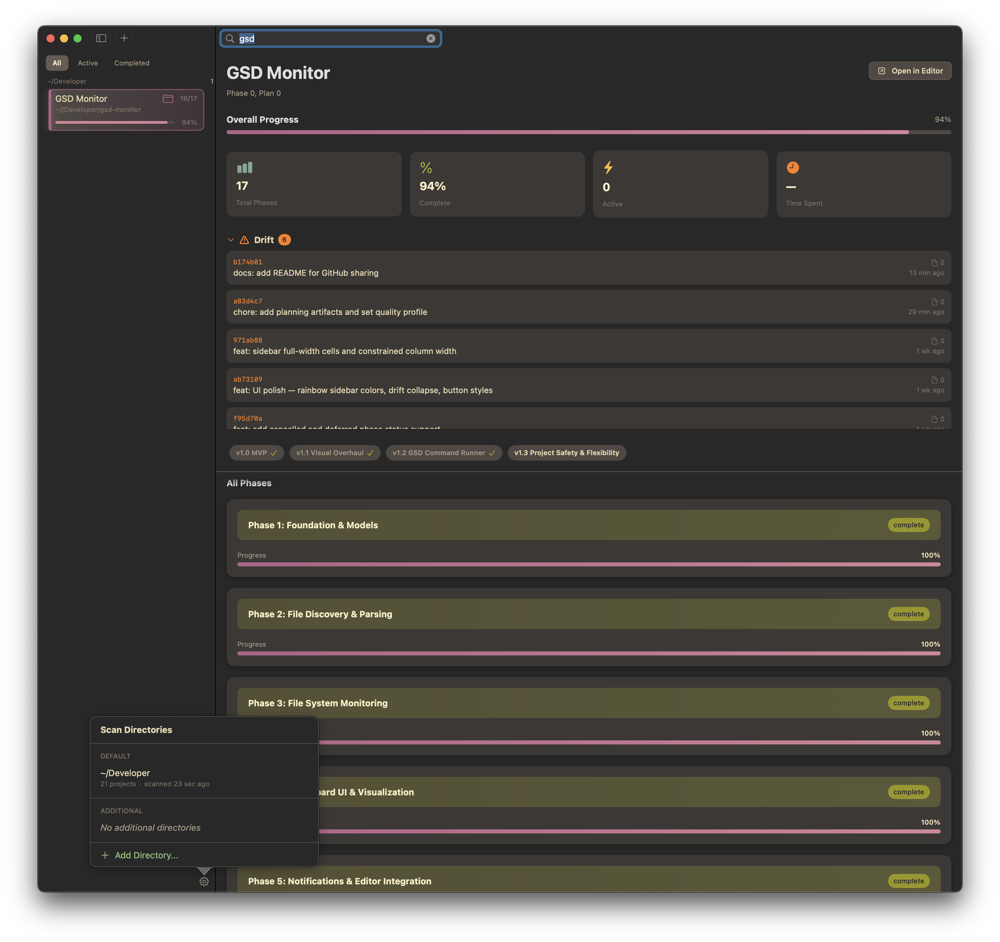
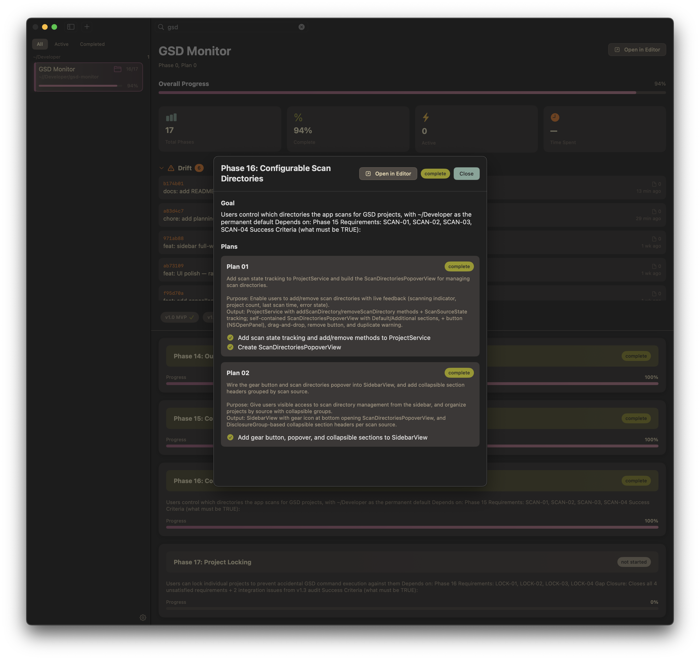

# GSD Monitor

A native macOS dashboard for visualizing your [GSD](https://github.com/gsd-build/get-shit-done) projects. See roadmaps, phases, tasks, and progress across all your projects — updated live as you work.





## What It Does

GSD Monitor scans your developer directories for `.planning/` folders and renders them as a visual dashboard. When Claude Code runs GSD commands in your terminal, the app updates instantly via macOS FSEvents — no refresh needed.

- **Multi-project sidebar** — all your GSD projects in one place, grouped by directory
- **Phase cards** — visual progress bars, status badges, goals, and requirements for each phase
- **Milestone timeline** — connected nodes showing your project's journey
- **Drift detection** — highlights git commits made outside the GSD workflow
- **Cmd+K command palette** — search across all projects, phases, and plans
- **Live file watching** — FSEvents-based, updates in real-time as files change
- **Stats dashboard** — completion percentage, active phases, execution metrics

## Tech Stack

| | |
|---|---|
| **Language** | Swift 6 |
| **UI** | SwiftUI (macOS 14+) |
| **Architecture** | @Observable + Actor-based concurrency |
| **File Monitoring** | FSEvents |
| **Theme** | Gruvbox Dark (27 colors, forced dark mode) |
| **Dependencies** | Only [swift-markdown](https://github.com/swiftlang/swift-markdown) |
| **LOC** | ~5,800 across 47 files |

## Project Structure

```
GSDMonitor/
├── App/           # Entry point, AppDelegate
├── Models/        # Project, Phase, Plan, Requirement, State, Roadmap
├── Services/      # ProjectService, FileWatcher, Parsers, Search, Notifications
├── Views/
│   ├── Dashboard/       # PhaseCard, Timeline, Stats, Drift, Requirements
│   ├── CommandPalette/  # Cmd+K search overlay
│   ├── Settings/        # Scan dirs, editor integration, notifications
│   └── Components/      # StatusBadge, AnimatedProgressBar, ButtonStyle
├── Theme/         # Gruvbox Dark color system
└── Utilities/     # Preview fixtures
```

## Building

Requires Xcode 16+ and macOS 14+.

```bash
git clone https://github.com/allcounter/gsd-monitor.git
cd gsd-monitor
open GSDMonitor.xcodeproj
# Build and run (Cmd+R)
```

The app scans `~/Developer` by default. Add more directories in Settings.

## Version History

| Version | Focus | Highlights |
|---------|-------|------------|
| **v1.0** | MVP | Multi-project sidebar, roadmap visualization, live file watching, editor integration |
| **v1.1** | Visual Overhaul | Gruvbox Dark theme, animated progress bars, stats cards, milestone timeline |
| **v1.2** | Command Runner | Embedded GSD command execution with PTY, live output, command history |
| **v1.3** | Safety & Flexibility | Configurable scan directories, project grouping *(in progress)* |

## Built With GSD

This entire app was planned, built, and verified using the GSD workflow. The `.planning/` directory contains the full history — roadmaps, phase plans, state tracking, and milestone audits. It's both a GSD tool and a GSD project.

## License

MIT
